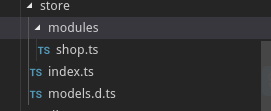

## 背景

上一篇文章进行了，vue + typescript的搭建，这里使用搭建的项目进行相应的开发和实践，我将从插件的使用，部分出现的问题，还有就是目录结构来梳理。注意这里只关注与前端项目。不打算使用axios之类的http库。所以都是专注入渲染层。

## 项目改造

1. 添加需要的npm包
  添加 vuex 的装饰器

  ```shell

  yarn add vuex-module-decorators

  ```

  添加 vuex 的引用

  ```shell

  yarn add vuex-class

  ```

1. 修改stroe目录
   创建对应的文件一个入口文件index.ts 一个 interface文件 models.d.ts 以及模块文件如下
   

    * shop.ts module 模块

    ```js
    import { Module, VuexModule, Mutation, Action } from 'vuex-module-decorators';
      import store from '@/store';
      import { ListContent } from '../models';
      @Module({
          namespaced: true,
          name: 'shop',
          store,
      })

      @Module
      export default class ShopMoudle extends VuexModule {
          private shopList: ListContent[] = [];
          private shopDetail: ListContent = {
              imgName: '',
              itemName: '',
          };

          @Mutation
          private setShopList(value: ListContent[]) {
              this.shopList = value;
          }
          @Mutation
          private setShopDetail(value: ListContent) {
              this.shopDetail = value;
          }
      }

    ```

    * index.ts

    ```js
    import Vue from 'vue';
    import Vuex from 'vuex';
    import ShopMoudle from './modules/shop';

    Vue.use(Vuex);

    export default new Vuex.Store({
      modules: {
        shop: ShopMoudle,
      },
    });

    ```

   * model.d.ts

   ```js
    export interface ListContent {
        imgName:string;
        itemName:string;
    }
   ```

   * 上面就是使用[vuex-module-decorators](https://www.npmjs.com/package/vuex-module-decorators)的使用方法如何在组件使用ts的思想调用呢，就是下面来讨论的。

2. 组件中的代码编写

   ```ts
   import { Vue, Component} from 'vue-property-decorator';
    import {
      State,
      Getter,
      Action,
      Mutation,
      namespace,
    } from 'vuex-class';
    import { ListContent } from '@/interface/data/models';

    const shopList = namespace('shop');

    @Component
    export default class Detail extends Vue {
      private pageDetail: any = {
        head: {
              img1: '',
              img2: '',
              img3: '',
          },
          price: '',
          content: ``,
          footer: [
            '',
          ],
      };
      @shopList.State('shopDetail') private shopDetail!: ListContent;
      private mounted() {
        const path: string = this.shopDetail.imgName;
        this.pageDetail = require(`../../public/source/${path}/index`).default;
      }
    }
   ```

上面的列子在组件中使用[vuex-class](https://www.npmjs.com/package/vuex-class) 主要是使用一些装饰器实现调用，这里面的调用方法涉及的范围主要是注意开启了namespace的用法，这里还嵌套使用了[vue-property-decorator](https://www.npmjs.com/package/vue-property-decorator)这里面需要注意的是使用@component之后组件里面的代码必须遵循tslint的规范，外部代码则不受限制，然后这个包也引用了许多的方法可以参考实现。

* @Prop
* @PropSync
* @Model
* @Watch
* @Provide
* @Inject
* @ProvideReactive
* @InjectReactive
* @Emit
* @Ref
* @Component (provided by vue-class-component)
* Mixins (the helper function named mixins provided by vue-class-component)

我这个项目比较简单就没有使用太多的装饰器方法

1. 这里面还有些小东西分享一下

* 手机的rem大小设置

  ```ts
  ((doc, win): void => {
    const docEl = doc.documentElement;
    /**
     * orientationchange 判断设备是处于横屏还是竖屏了
    */
    const resizeEvt: string =
      'orientationchange' in window ? 'orientationchange' : 'resize';
    const recalc = (): void => {
      const clientWidth = docEl.clientWidth;
      if (!clientWidth) {
        return;
      } else {
        docEl.style.fontSize = 50 * (clientWidth / 375) + 'px';
        return;
      }
    };
    if (!doc.addEventListener) {
      return;
    }
    win.addEventListener(resizeEvt, recalc, false);
    doc.addEventListener('DOMContentLoaded', recalc, false);
  })(document, window);

  ```

* 由于使用的前端静态代理无法使用外部图片资源动态获取所以使用后public 文件夹来存储资源。在使用的时候不用配置直接使用public下面的地址不会被解析打包的。

总结

主要完善了项目的基本使用包的熟悉，以及ts语法的熟悉，项目架设和使用中体会到了vuets的优势，在项目初期避免接口和类型导致赋值出错，但是不足的地方就是没有体现出ts面向对象方面的优势，以及项目的简易程度会下降。总的来说企业项目可以尝试使用ts构建vue项目（马上新版就需要使用ts），能够增加稳定性。项目地址[https://manure.chi-chi.shop/](https://manure.chi-chi.shop/)github[https://github.com/inkylamb/vue-typescript](https://github.com/inkylamb/vue-typescript)
