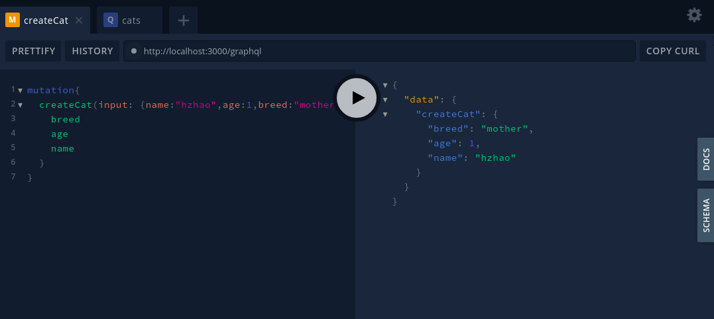
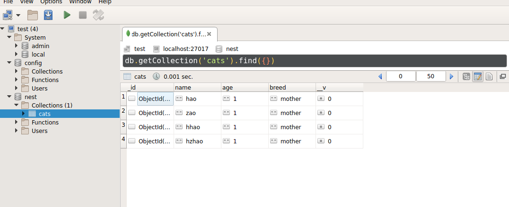

## 技术概述

 用官方的语言描述下就是：GraphQL 既是一种用于 API 的查询语言也是一个满足你数据查询的运行时。 GraphQL 对你的 API 中的数据提供了一套易于理解的完整描述，使得客户端能够准确地获得它需要的数据，而且没有任何冗余，也让 API 更容易地随着时间推移而演进，还能用于构建强大的开发者工具。

## 技术优势

 现在前后端分离的方法主要使用RESTapi来实现这里就是对比两个api工具的简单体会

 1. 很多的端点，这个是使用rest的体会，每一个接口对应一个请求

 2. 过度获取和信息不足，获取的信息大多冗余，或者缺少导致需要后台重新开发

 3. 版本，在版本控制上，grapQL就只需要添加新的类型或者删除旧键。

 4. 当下为移动时代数据交互多变复杂，需求多样,解决如下问题
    * 性能不佳
    * 很多端点
    * 过度获取或欠读数据
    * 每次我们需要包含或删除某些内容时，需要运送其他版本
    * 难以理解API

## 技术实践

 这里我使用nestjs作为后台实现，数据库为mongodb。安装教程参考使用系统。这里用手把手的方式描述整个搭建流程。

 在 Nest 应用程序中至少有一个模块，即根模块。根模块是 Nest 应用程序的起点，对于一个小项目来说一个程序可能只有一个模块，但是对于大型项目来说可能就会有多个模块了，这样一来我们需要对模块进行分类，将相同类型的模块组合在一起，形成一个树状关系的模块树。这里添加好grapQL和mongoose的模块

 ```ts
    //app.module.ts
    import { Module } from '@nestjs/common';
    import { AppController } from './app.controller';
    import { AppService } from './app.service';
    import { GraphQLModule } from '@nestjs/graphql';
    import { CatsModule } from './cats/cats.module';
    import { MongooseModule } from '@nestjs/mongoose';

    @Module({
    imports: [
        CatsModule,
        GraphQLModule.forRoot({
        autoSchemaFile: 'schema.gql',
        }),
        MongooseModule.forRoot('mongodb://localhost/nest'),
    ],
    controllers: [AppController],
    providers: [AppService],
    })
    export class AppModule {}

 ```

 这个是新建立的一个CatModule，注入了catService以及相关的catResolver，建立对应的数据库的实例。

 ```ts
 //cats.module.ts
    import { Module } from '@nestjs/common';
    import { CatsResolver } from './cats.resolver';
    import { MongooseModule } from '@nestjs/mongoose';
    import { CatSchema } from './cats.schema';
    import { CatsService } from './cats.service';

    @Module({
        imports: [MongooseModule.forFeature([{ name: 'Cat', schema: CatSchema }])],
        providers: [CatsResolver, CatsService],
    })
    export class CatsModule {}

 ```

 这个是controller主要是暴露grapQL的端口如果。这里包含两个功能，数据表的查询，和数据表的建立。
 简单介绍这里使用的grapQL的功能，这里面主要是一个查询Query，一个Mutatios操作，两个请求类似于对应的get请求和post请求。一个作为查询一个作为操作，还有一些不足一介绍了。实际都使用的是post请求。

 ```ts
 //cats.resolver.ts
    import { Resolver, Query, Mutation, Args } from '@nestjs/graphql';
    import { CatsService } from './cats.service';
    import { CatInput } from './input/cat.input';
    import { CatType } from './dto/create-cat.dto';

    @Resolver()
    export class CatsResolver {
        constructor(
            private readonly catsService: CatsService,
        ) {}

        @Query(() => String)
        async hello() {
            return 'hello';
        }

        @Query(() => [CatType])
        async cats() {
            return this.catsService.findAll();
        }

        @Mutation(() => CatType)
        async createCat(@Args('input') input: CatInput) {
            return this.catsService.create(input);
        }
    }

 ```
 
 mongoose数据库结构

 ```ts
    //cats.schema.ts
    import * as mongoose from 'mongoose';

    export const CatSchema = new mongoose.Schema({
        name: String,
        age: String,
        breed: String,
    });

 ```

 service具体的一些数据库的数据操作

 ```ts
    //cats.service.ts
    import { Model } from 'mongoose';
    import { Injectable } from '@nestjs/common';
    import { InjectModel } from '@nestjs/mongoose';
    import { Cat } from './interfaces/cat.interface';
    import { CatInput } from './input/cat.input';

    @Injectable()
    export class CatsService {
    constructor(@InjectModel('Cat') private readonly catModel: Model<Cat>) {}

    async create(createCatDto: CatInput): Promise<Cat> {
        const createdCat = new this.catModel(createCatDto);
        return await createdCat.save();
    }

    async findAll(): Promise<Cat[]> {
        return await this.catModel.find().exec();
    }
    }

 ```

  interface

 ```ts
    //interfaces/cat.interface
    import { Document } from 'mongoose';

    export interface Cat extends Document {
        readonly name: string;
        readonly age: number;
        readonly breed: string;
    }
 ```

 自动的数据类型非空校验等

 ```ts
    // input/cat.input
    import { Field, Int, InputType } from 'type-graphql';

    @InputType()
    export class CatInput {
        @Field()
        readonly name: string;
        @Field(() => Int)
        readonly age: number;
        @Field()
        readonly breed: string;
    }

 ```

   创建的校验

  ```ts
    // dto/create-cat.dto
    import { ObjectType, Field, Int, ID } from 'type-graphql';

    @ObjectType()
    export class CatType {
        @Field(() => ID)
        id: string;
        @Field()
        readonly name: string;
        @Field(() => Int)
        readonly age: number;
        @Field()
        readonly breed: string;
    }
 ```

 好了现在启动服务打开浏览器网页http://localhost:3000/graphql

 查询

 

 添加

 

 数据库可视化工具查看数据库

 

## 技术总结

这次使用GrapQL的体验来说非常舒服，无论是使用查询还是，修改。作为前端人员对于这个接口的使用来说，可以让aip更加的简洁，刚刚做的项目一个详情页面请求了至少8到10个接口。在我认知里面这个造成的时延是可怕的而且就算使用异步请求同时发送。也会在后端和前端增加不必要的资源消耗。接下来使用vue进行前端的grapQL实践。
