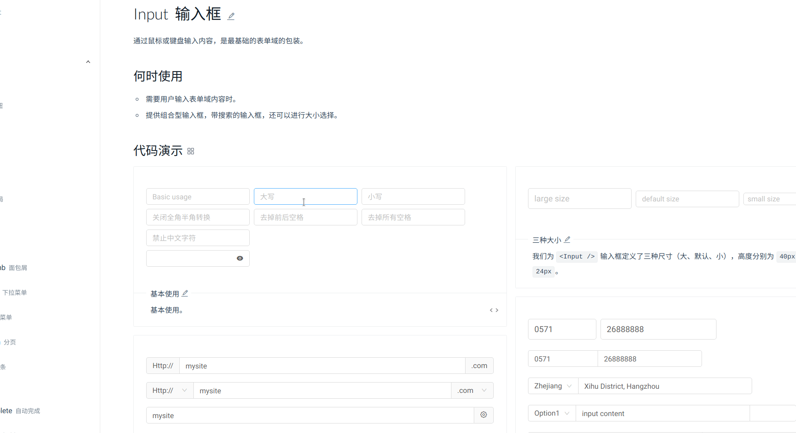
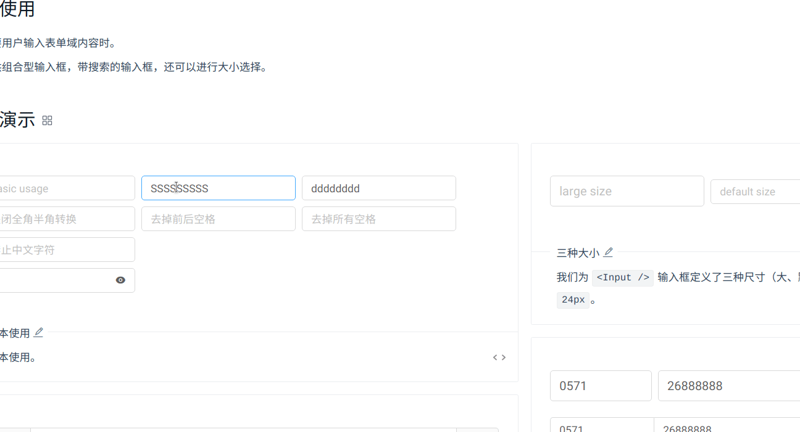

# react中input光标异常 

## 开篇

今天解决公司一个UI库的问题然后发现了一个奇异的现象，主要就是ui库里面的一个input组件存在一个属性介绍如下


| 参数 | 说明 | 类型 | 默认值 |
| --- | --- | --- | --- |
| typeCase | 组件的大小写输入限制。可选 `upper` `lower` | string |  |
当然看着挺简单的,就是实现输入都为大小写的问题，然而出现了下面的状况



感觉以后可能遇到加深下映像

### 代码分析

首先定位到实现代码，这里是通过每次输入获取的值进行转化。


```tsx
      transformValue(v: any) {
      const { typeCase, dbc2sbc = true, inputChinese } = this.props;
      let value = v;
      if (typeCase === 'upper') {
        value = upperCaseString(v);
      } else if (typeCase === 'lower') {
        value = lowerCaseString(v);
      }

      if (dbc2sbc && isDbc(v)) {
        value = dbcToSbc(v);
      }

      if (!inputChinese) {
        value = value.replace(/[\u4e00-\u9fa5]/g, '');
      }

      return value;
    }
```

既然这里是值转化的问题那为了避免我有没有不使用值转化就可以实现大小写

```less
    &-upper {
      text-transform: uppercase;
      }
      &-lower {
      text-transform: lowercase;
   }
```


```tsx
  getInputClassName() {
    const { prefixCls, size, disabled,typeCase } = this.props;
    return classNames(prefixCls, {
      [`${prefixCls}-sm`]: size === 'small',
      [`${prefixCls}-lg`]: size === 'large',
      [`${prefixCls}-disabled`]: disabled,
      [`${prefixCls}-upper`]: typeCase === 'upper',
      [`${prefixCls}-lower`]: typeCase === 'lower',
    });
  }
```
测试一下果然ojbk。


但是使用onChange 输出 e.target.value 好吧输出的就是我刚刚输入的没有实现大小写的真实转化，zzzz又要想方案了。

### 问题查找

不难看出除了这里的大小写转化有问题，中文输入和半角转化也一定翻车，我进行了测试，果不其然翻车了，所有只要设计到值转化的地方都有问题。本来想偷下懒看来不行了。

追宗溯源问题应该是react导致的所以好吧去看看github issue [问题位置](https://github.com/facebook/react/issues/955)

其中有一句
Figuring this out programmatically seems impossible to me in the general case. Even if we were content to return either of those, it's hard for me to imagine an algorithm that might work reliably. Let me know if I'm missing something.

其实主要是input输入变化多端react无法智能的判断用户的行为来实现满足用户心中所想，所以直接在改变了target值之后把对应的值以及光标渲染到了最后。所以把处理留给了我们自己来定制

最后看到这个，告诉我们最简单的方法就是修改值后直接把光标重置到以前就行

::: tip
I'm going to lock because a lot of new solutions in this thread look suspicious and likely point to other misunderstandings or bugs.

The canonical solution is to make sure you're calling setState with e.target.value during the onChange event. That should be enough to preserve the cursor.

If it's not enough for you, please file a new issue with your reproducing case.
:::

### 问题解决

所以我这边解决思路就是申明一个全局对象存储光标状态

然后在修改值之后对于光标位置进行定位然后使用记录位置进行修复，我看大部分都加了个对于新的props值的光标定位我也这样弄了个。

* 最简单解决

```jsx
  onChange={(event) => {
    const caretStart = event.target.selectionStart;
    const caretEnd = event.target.selectionEnd;
    // update the state and reset the caret
    this.updateState();
    event.target.setSelectionRange(caretStart, caretEnd);
  }}
```

* 下面是我项目中解决

```tsx
  handleChange = (e: any) => {
    const { onChange } = this.props;
    if (!this.isOnComposition) {
    // 在 onChange 时记录光标的位置
    if (this.input) {
      this.inputSelection = {
        start: this.input.selectionStart,
        end: this.input.selectionEnd,
      };
    }
      const transformValue = this.transformValue(e.target.value);
      if (transformValue !== e.target.value) {
        e.target.value = this.transformValue(e.target.value);
        if(this.inputSelection && (this.inputSelection.start || this.inputSelection.end)){
          e.target.setSelectionRange(this.inputSelection.start , this.inputSelection.end);
          this.inputSelection = null
        }
      }
    }
    if (onChange && isFunction(onChange)) {
      onChange(e);
    }
  };
```

```tsx

  componentDidUpdate(prevProps:InputProps) {
    const { inputSelection } = this;
    const { value } = prevProps;
    if (inputSelection) {
      // 在 didUpdate 时根据情况恢复光标的位置
      // 如果光标的位置小于值的长度，那么可以判定属于中间编辑的情况
      // 此时恢复光标的位置
      if (inputSelection.start && inputSelection.start < this.transformValue(value).length) {
        const input = this.input;
        input.selectionStart = inputSelection.start;
        input.selectionEnd = inputSelection.end;
        this.inputSelection = null;
      }
    }
  }

```

好了这里就解决了这个问题了


### 总结

* selectionStart：第一个被选中的字符的序号（index），从0开始。
* selectionEnd：被选中的最后一个字符的前一个。换句换说，不包括index为selectionEnd的字符。
* selectionDirection：选择的方向。可选值为forward、backward或none。
* react 当修改target时有状态的改变需要自己处理光标等一些属性，我觉得同样适用于vue等虚拟dom